# 🛒 IBRA - Online Shopping Site (Full Stack MERN)

A modern full-stack E-Commerce web application built using the MERN Stack with secure authentication, product management, cloud image uploads, cart system, online payments, and admin dashboard functionality.

---

# 🌐 Live Demo

## Frontend Deployment
[Visit Live Website](https://shopping-app-one-zeta.vercel.app/)

## Backend API
[Backend API](https://shopping-app-j1vl.onrender.com)

---

# 🚀 Project Overview

This project is a fully functional E-Commerce platform designed to simulate a real-world online shopping application.

The platform allows users to:

* Browse products by category and brand
* View detailed product information
* Add items to cart
* Place secure orders using Razorpay
* Upload and manage products from admin dashboard
* Store product images on Cloudinary
* Manage inventory and order statuses
* Write product reviews and ratings

The project follows a modern client-server architecture using React for the frontend and Node.js + Express for backend APIs.

---

# ✨ Features

## 👤 User Features

* User Registration & Login
* JWT Authentication
* Secure Password Hashing using bcrypt
* Product Listing Page
* Product Details Modal
* Product Filtering & Sorting
* Category & Brand Navigation
* Shopping Cart Functionality
* Order Placement
* Razorpay Payment Integration
* Review & Rating System
* Order History
* Responsive UI Design

---

## 🛠️ Admin Features

* Admin Dashboard
* Add New Products
* Edit Existing Products
* Delete Products
* Product Stock Management
* Sale Price Management
* Upload Product Images
* Manage Orders
* Update Order Status
* Inventory Control

---

# 🧠 Why This Project?

This project was developed to understand how modern E-Commerce systems work in real-world production environments.

The application demonstrates:

* Full Stack Development
* REST API Integration
* Authentication & Authorization
* Payment Gateway Integration
* Cloud Storage Handling
* State Management using Redux Toolkit
* Frontend & Backend Communication
* Real-time UI Updates
* CRUD Operations
* Responsive Design Principles

---

# 🏗️ Tech Stack

## Frontend

<p align="left">
  
</p>

- React.js
- Vite
- Tailwind CSS
- Redux Toolkit

---

## Backend

<p align="left">
  
</p>

- Node.js
- Express.js
- MongoDB

---

# 📂 Folder Structure

```bash
project-root/
│
├── frontend/
│   ├── src/
│   ├── assets/
│   ├── components/
│   ├── pages/
│   ├── store/
│   ├── config/
│   ├── App.jsx
│   └── main.jsx
│
├── backend/
│   ├── controllers/
│   ├── helpers/
│   ├── middleware/
│   ├── models/
│   ├── routes/
│   ├── server.js
│   └── package.json
│
├── screenshots/
│
├── README.md
└── LICENSE
```

---

# 🔐 Authentication System

The platform uses JWT-based authentication.

## Authentication Flow

1. User registers using email and password
2. Password is encrypted using bcrypt
3. JWT token is generated on login
4. Token is stored securely
5. Protected routes verify token before access

This ensures secure access to user and admin functionalities.

---

# ☁️ Cloudinary Image Upload System

The project integrates Cloudinary for cloud-based image storage.

## How It Works

1. Admin uploads image from dashboard
2. Multer stores image temporarily in memory
3. Image converts into Base64 format
4. Cloudinary uploads image to cloud
5. Cloudinary URL is stored in MongoDB
6. Frontend fetches image using URL

This improves:

* Performance
* Scalability
* Faster image loading
* Storage management

---

# 💳 Razorpay Payment Integration

The application supports secure online payments using Razorpay.

## Payment Flow

1. User places order
2. Backend creates Razorpay order
3. Razorpay checkout opens
4. User completes payment
5. Signature verification occurs
6. Payment status updates
7. Order becomes confirmed

The payment verification uses HMAC SHA256 signature validation.

---

# 🛍️ Product Management System

Admin can:

* Add products
* Edit products
* Delete products
* Upload product images
* Add sale pricing
* Update stock quantities

The shopping view dynamically updates based on database changes.

---

# ⭐ Review & Rating System

Users can:

* Give star ratings
* Write reviews
* View average ratings
* Read other customer reviews

The review system improves user interaction and product trust.

---

# 📦 Order Management System

The application includes a complete order workflow.

## Order Statuses

* Pending
* Confirmed
* In Process
* In Shipping
* Delivered
* Rejected

Admins can update order status directly from dashboard.

---

# 🎨 UI & UX Highlights

* Responsive design
* Modern product cards
* Sale badges
* Product detail modal
* Hero banner slider
* Category navigation
* Smooth transitions
* Mobile-friendly layout

---

# 📈 Learning Outcomes

This project helped in understanding:

* MERN Architecture
* REST APIs
* MongoDB Database Design
* Redux State Management
* Payment Gateway Integration
* Authentication Systems
* Cloud Media Handling
* Deployment Concepts
* Frontend Optimization
* Backend API Development

---

# ⚙️ Installation Guide

## 1️⃣ Clone Repository

```bash
git clone <your-repository-url>
```

---

## 2️⃣ Install Frontend Dependencies

```bash
cd frontend
npm install
```

---

## 3️⃣ Install Backend Dependencies

```bash
cd backend
npm install
```

---

# 🔑 Environment Variables

Create a `.env` file inside backend folder.

```env
MONGODB_URI=your_mongodb_connection
JWT_SECRET_KEY=your_jwt_secret
RAZORPAY_KEY_ID=your_razorpay_key
RAZORPAY_KEY_SECRET=your_razorpay_secret
CLOUDINARY_CLOUD_NAME=your_cloud_name
CLOUDINARY_API_KEY=your_api_key
CLOUDINARY_API_SECRET=your_api_secret
```

---

# ▶️ Run Project

## Start Backend

```bash
cd backend
npm run dev
```

---

## Start Frontend

```bash
cd frontend
npm run dev
```

---

# 🌐 Future Improvements

Possible future enhancements:

* Wishlist System
* Coupon System
* AI Product Recommendations
* Email Notifications
* Invoice PDF Generation
* Multi-Vendor Support
* Real-time Order Tracking
* Admin Analytics Dashboard
* Dark Mode
* PWA Support

---

# 📸 Below are some preview screenshots of the application interface and functionality.

## 🏠 Home Hero Section
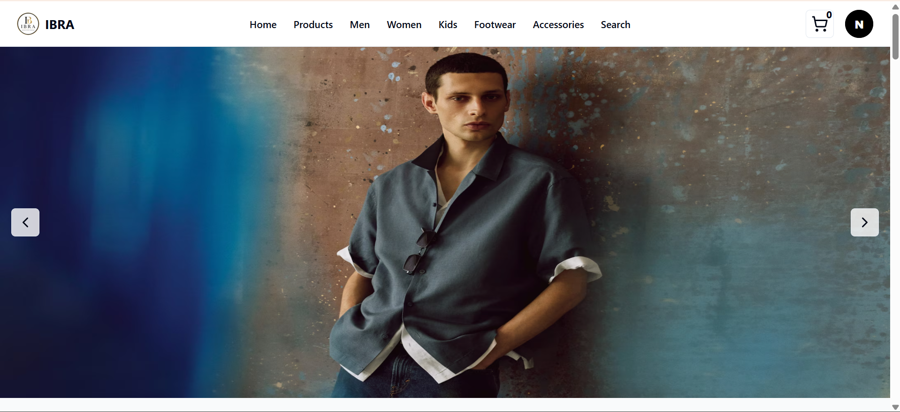

---

## 🛍️ Shop by Category & Brand
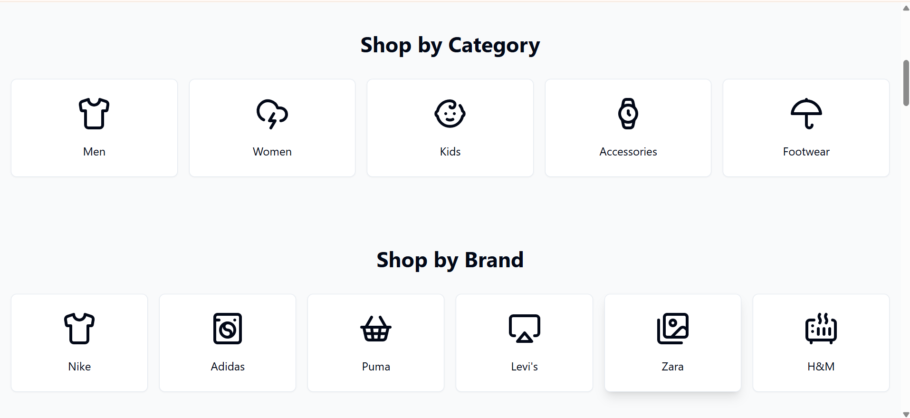

---

## ⭐ Featured Products
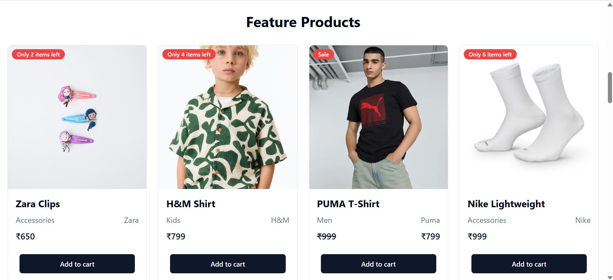

---

## 🛒 Shopping Cart Drawer
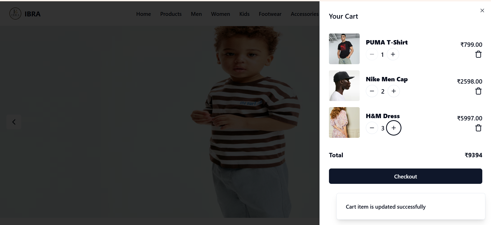

---

## 📦 Checkout Page
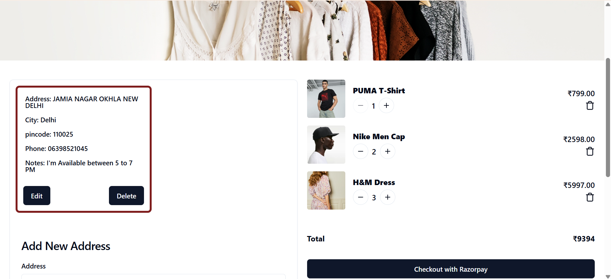

---

## 💳 Razorpay Payment Gateway
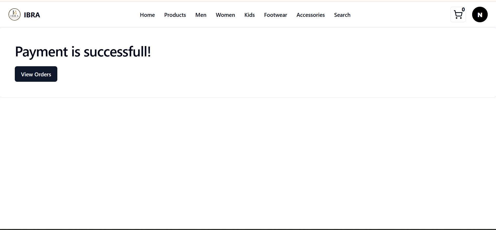

---

## ✅ Payment Success Page
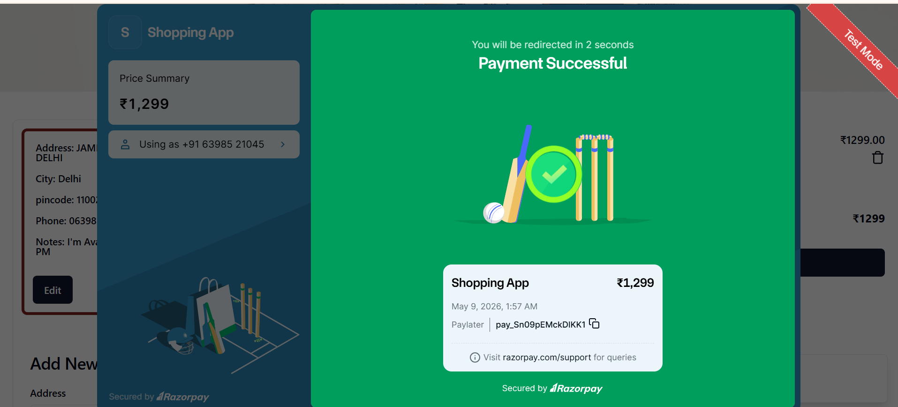

---

## 📜 Order History
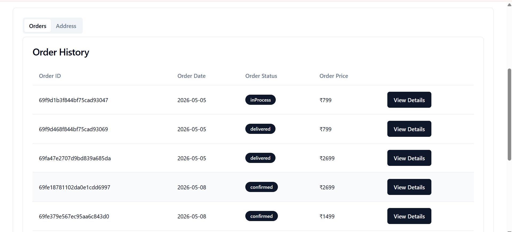

---

## 📍 Address Management
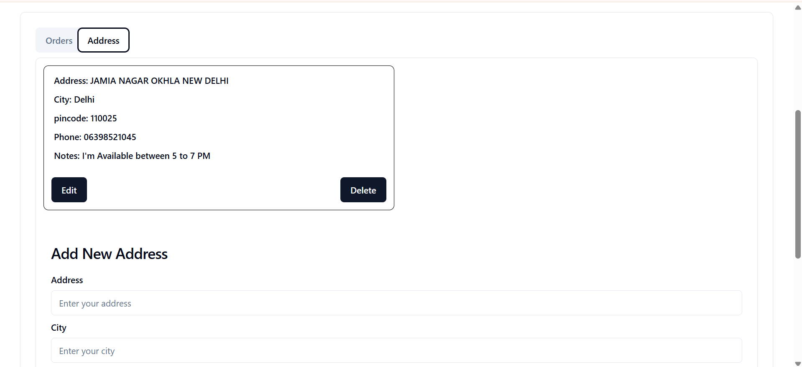

---

## ⭐ Product Details & Reviews
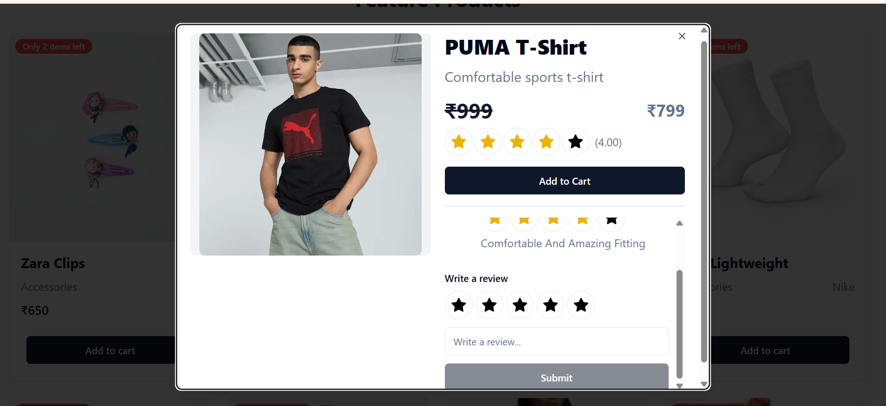

---

# 🛠️ Admin Panel

## 📊 Admin Dashboard
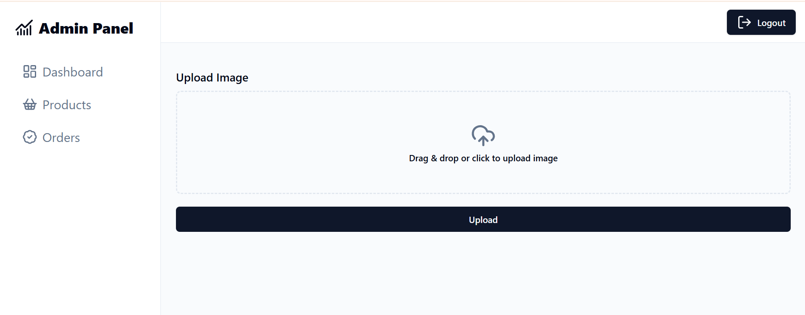

---

## ➕ Add Product
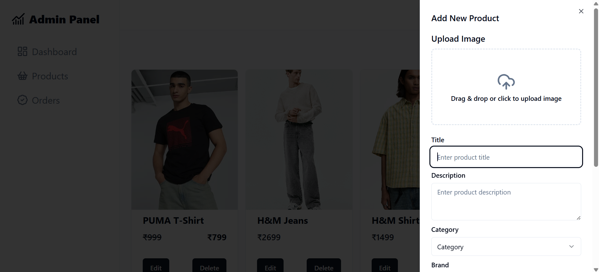

---

## 📦 Admin Order Management
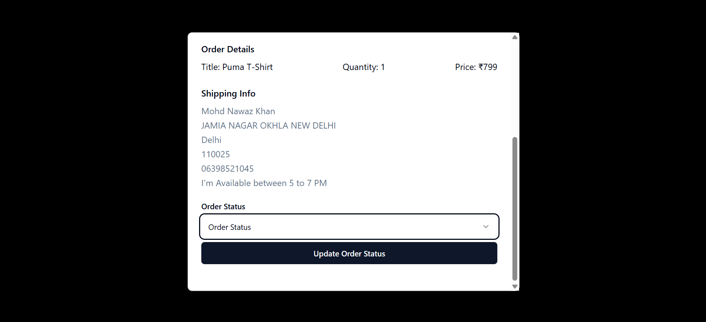

---

# 📌 Conclusion

This project demonstrates a complete real-world Full Stack MERN E-Commerce workflow.

It combines:

* Secure Authentication
* Cloud Storage
* Online Payments
* Dynamic Product Management
* Responsive UI
* Modern Frontend Design
* REST API Architecture

The project reflects practical implementation of modern web development technologies and industry-level application structure.

---

# 👨‍💻 Author

Mohd Nawaz Khan

---

# 📄 License

This project is licensed under the MIT License.
